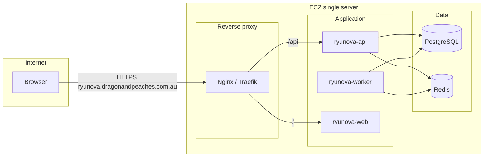

# RyuNova Platform – Deployment (Docker, Docker Compose, EC2, GitHub Actions)

**Operational runbook (EC2, shared Postgres, ALB, FinText-aligned secrets):** see **`DEPLOYMENT_EC2_ALB.md`**.

**Target:** Single EC2 server  
**URL:** https://ryunova.dragonandpeaches.com.au  
**Runtime:** Docker and Docker Compose  
**CI/CD:** GitHub Actions deploys to EC2 and runs the stack.

**Stack (confirmed):** **FastAPI** (API backend), **Django** (frontend / admin UI), PostgreSQL, Redis, Celery.

This document describes the end deployment status, list of services on the server, and recommended Docker containers/images aligned with the [RyuNova architecture](plans/coffee_machine_listing_app_architecture_1452ab43.plan.md) and [microservice design](plans/ryunova_microservice_architecture_b008e61c.plan.md), consolidated for a **single-server solution**.

---

## 1. Single-server architecture (overview)

On one EC2 instance we run all components via Docker Compose. Backend services are **consolidated** into one API process and one worker process to keep the single server simple; the same codebase can be split into more containers later if we move to multi-host.



- **Nginx (or Traefik):** TLS termination, host `ryunova.dragonandpeaches.com.au`, route `/api` to API, `/` to frontend.
- **ryunova-api:** Single API service (FastAPI) implementing Gateway + Product, Identity, Channel Registry, Listing, Inventory, Order, Notification, Audit (shared DB).
- **ryunova-worker:** Celery worker running Listing Orchestrator and channel adapters; consumes Redis queue.
- **ryunova-web:** Admin UI (Django) – Django app served by Gunicorn (or uWSGI); serves templates and static files; frontend calls FastAPI at `/api`.
- **PostgreSQL:** One database; all `ryunova_*` tables.
- **Redis:** Celery broker and result backend; optional cache.

---

## 2. List of services running on the server

| # | Service name (container) | Purpose | Port (internal) |
|---|---------------------------|---------|------------------|
| 1 | **proxy** (or **nginx**) | Reverse proxy, TLS, route to API and web. Single entry for ryunova.dragonandpeaches.com.au. | 80, 443 |
| 2 | **ryunova-api** | Backend API (FastAPI): auth, products, channels, listings, inventory, orders, notifications, audit. Serves `/api`. | 8000 |
| 3 | **ryunova-worker** | Celery worker: listing jobs, List/Sales/Delist engines, channel adapters. | — |
| 4 | **ryunova-web** | Admin UI (Django). Gunicorn serves Django app; proxy forwards `/` to it. | 8000 (Gunicorn) |
| 5 | **postgres** | PostgreSQL 16; all application data (ryunova_* schema). | 5432 |
| 6 | **redis** | Redis 7; Celery broker, result backend, optional cache. | 6379 |

**Total: 6 containers** (or 5 if the web is served by the same nginx that does proxy).

---

## 3. Suggested Docker images and containers

### 3.1 Base / official images

| Container | Suggested image | Notes |
|-----------|-----------------|--------|
| **postgres** | `postgres:16-alpine` | Official PostgreSQL; Alpine for smaller size. |
| **redis** | `redis:7-alpine` | Official Redis; Alpine. |
| **proxy** | `nginx:alpine` or `traefik:v3.0` | Nginx: simple reverse proxy + static. Traefik: dynamic config, optional Let’s Encrypt. |

### 3.2 Application images (built from repo)

| Container | Image (example) | Build context | Notes |
|-----------|-----------------|---------------|--------|
| **ryunova-api** | `ghcr.io/dragon-and-peaches/ryunova-api:latest` or built in GitHub Actions | Backend (e.g. `backend/` or `api/`) with Dockerfile (Python 3.11, FastAPI) | Single FastAPI app; env: `DATABASE_URL`, `REDIS_URL`, `SECRET_KEY`, etc. |
| **ryunova-worker** | Same repo, e.g. `ghcr.io/dragon-and-peaches/ryunova-worker:latest` | Same backend; Dockerfile runs Celery worker instead of uvicorn | `celery -A app.worker worker -l info`; same env as API. |
| **ryunova-web** | `ghcr.io/dragon-and-peaches/ryunova-web:latest` | Django app (e.g. `frontend/` or `web/`) – Dockerfile: Python, Django, Gunicorn; env: `API_BASE_URL` for FastAPI. | Django templates/views; optional static files; calls FastAPI for data. |

Image names and registry (e.g. GitHub Container Registry, ECR) can be chosen to match your CI and AWS setup.

### 3.3 Docker Compose service names (suggested)

- `proxy` – nginx (or traefik)
- `api` – ryunova-api
- `worker` – ryunova-worker
- `web` – ryunova-web
- `postgres` – postgres
- `redis` – redis

---

## 4. End deployment status (what “done” looks like)

| Item | Status / description |
|------|----------------------|
| **Source** | Application code in GitHub repo (e.g. Dragon-and-Peaches/ryunova-channels or under ROMS_Documentation). |
| **Build** | GitHub Actions: on push to main (or release tag), build API, worker, and web images; push to registry. |
| **Deploy** | GitHub Actions: SSH or AWS SSM to EC2; pull images; `docker compose pull && docker compose up -d`. |
| **Server** | Single EC2 instance (e.g. t3.small or t3.medium); Docker and Docker Compose installed; security group: 80, 443 from internet; 22 for SSH/SSM. |
| **Domain** | DNS for `ryunova.dragonandpeaches.com.au` points to EC2 (A or CNAME). |
| **TLS** | Certificate for ryunova.dragonandpeaches.com.au (Let’s Encrypt via Traefik/Certbot or ACM if using ALB). |
| **Data** | PostgreSQL data and Redis data on EC2 (volumes); backups configured (e.g. pg_dump cron, or RDS snapshot if DB moved to RDS later). |
| **Secrets** | DB password, Redis password, API secret key, channel credentials: from env file or AWS Secrets Manager, not in repo. |
| **Access** | Staff open https://ryunova.dragonandpeaches.com.au → proxy → login → Admin UI; API at https://ryunova.dragonandpeaches.com.au/api. |

---

## 5. Example Docker Compose layout (single server)

High-level structure; exact paths and env names to match your repo.

```yaml
# docker-compose.yml (conceptual)
services:
  proxy:
    image: nginx:alpine
    ports:
      - "80:80"
      - "443:443"
    volumes:
      - ./nginx.conf:/etc/nginx/nginx.conf:ro
      - ./certs:/etc/nginx/certs:ro
    depends_on:
      - api
      - web

  api:
    image: ghcr.io/dragon-and-peaches/ryunova-api:latest
    env_file: .env
    environment:
      - DATABASE_URL=postgresql://...
      - REDIS_URL=redis://redis:6379/0
    depends_on:
      postgres: { condition: service_healthy }
      redis: { condition: service_started }

  worker:
    image: ghcr.io/dragon-and-peaches/ryunova-worker:latest
    env_file: .env
    depends_on:
      - api
      - redis
      - postgres

  web:
    image: ghcr.io/dragon-and-peaches/ryunova-web:latest
    env_file: .env
    environment:
      - API_BASE_URL=http://api:8000
    # or build: ./web (Django app)

  postgres:
    image: postgres:16-alpine
    environment:
      POSTGRES_DB: ryunova
      POSTGRES_USER: ryunova
      POSTGRES_PASSWORD: ${POSTGRES_PASSWORD}
    volumes:
      - postgres_data:/var/lib/postgresql/data
    healthcheck:
      test: ["CMD-SHELL", "pg_isready -U ryunova"]
      interval: 5s
      timeout: 5s
      retries: 5

  redis:
    image: redis:7-alpine
    command: redis-server --appendonly yes
    volumes:
      - redis_data:/data

volumes:
  postgres_data:
  redis_data:
```

- **proxy** forwards `ryunova.dragonandpeaches.com.au` to `api` and `web`.
- **api** and **worker** use same codebase; worker runs Celery.
- **postgres** and **redis** use volumes so data survives restarts.

---

## 6. GitHub Actions (deploy to EC2)

- **Trigger:** Push to `main` (or tag `v*`). Optional: deploy only when paths like `backend/`, `web/` (Django), `docker/` change.
- **Steps (conceptual):**
  1. Checkout repo.
  2. Build API and worker images (and optionally web); push to GHCR or ECR.
  3. Copy to EC2 (e.g. `docker compose` file and `.env` from secrets) or use EC2 as runner.
  4. On EC2: `docker compose pull && docker compose up -d`.
  5. Optional: smoke test (curl https://ryunova.dragonandpeaches.com.au/health).
- **Secrets:** `EC2_HOST`, `EC2_SSH_KEY` or `AWS_*` for SSM; `POSTGRES_PASSWORD`, `SECRET_KEY`, etc., in GitHub Secrets or AWS Secrets Manager (pulled on EC2).

---

## 7. Summary: services on the server

| Service | Image (suggested) | Role |
|---------|-------------------|------|
| **proxy** | nginx:alpine (or traefik) | TLS, route to API and web; ryunova.dragonandpeaches.com.au |
| **ryunova-api** | Custom (FastAPI) | Backend API – Gateway, Product, Identity, Channels, Listing, Inventory, Order, Notification, Audit |
| **ryunova-worker** | Custom (Celery) | Listing Orchestrator, channel adapters, job queue consumer |
| **ryunova-web** | Custom (Django + Gunicorn) | Admin UI (Django frontend; calls FastAPI) |
| **postgres** | postgres:16-alpine | PostgreSQL – single DB, all ryunova_* tables |
| **redis** | redis:7-alpine | Celery broker, result backend, optional cache |

**Single server:** One EC2 instance; Docker Compose runs these six containers; GitHub Actions builds and deploys; application is available at **https://ryunova.dragonandpeaches.com.au**.

---

*Document version: 1.0. For use by DevOps and development when implementing deployment.*
