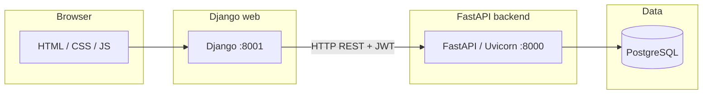

# RyuNova services — architecture and how to run them

This document describes how the pieces fit together and how to start or stop them for local development. Production deployments will use process managers (systemd, Docker, etc.) but the same processes apply.

## Technical architecture (brief)

RyuNova is split into a **browser-facing web app** and a **JSON API**, backed by **PostgreSQL** (and optional object storage for uploads, depending on configuration).



- **Django (`web/`)** serves pages (catalog, auth flows, invitations), stores the session (SQLite file by default for sessions only), and calls the API with the user’s bearer token after login. Optional **Cloudflare Turnstile** keys in `web/.env` gate the login forms; otherwise a built-in human quiz is used (see **`docs/TURNSTILE.md`** to enable it, and `docs/ENVIRONMENT.md` for env overview).
- **FastAPI (`backend/`)** implements `/api/v1/...`, issues JWTs, enforces tenancy, talks to PostgreSQL, and can send sign-in OTP email when SMTP is configured there.
- **PostgreSQL** holds application data; apply SQL patches from `db/` when upgrading (see `db/README.md`).

Traffic you care about for local work:

| Port (typical) | Process | Purpose |
|----------------|---------|---------|
| **8000** | Uvicorn → FastAPI | API + OpenAPI docs (e.g. `/docs`) |
| **8001** | Django `runserver` | Web UI |

## Prerequisites

- Python virtualenvs in `backend/.venv` and `web/.venv` (or your own layout; adjust commands).
- PostgreSQL running and `backend/.env` pointing at it (see `backend/.env.example`).
- `web/.env` with `RYUNOVA_API_BASE` aimed at the API (default `http://127.0.0.1:8000/api/v1`).

## Starting services (local)

From two terminals:

**1. API (FastAPI)**

```bash
cd backend
source .venv/bin/activate   # or: .venv/bin/activate.fish
uvicorn app.main:app --reload --host 0.0.0.0 --port 8000
```

**2. Web (Django)**

```bash
cd web
source .venv/bin/activate
python manage.py runserver 0.0.0.0:8001
```

Then open the UI at **http://127.0.0.1:8001** (or your machine’s LAN IP on port 8001). API docs: **http://127.0.0.1:8000/docs**.

## Stopping services

In each terminal where a server is running, press **Ctrl+C**. That stops Uvicorn or `runserver` for that session.

If a port is stuck (e.g. something else claimed 8000 or 8001), find and stop the process (examples on macOS/Linux):

```bash
lsof -i tcp:8000
lsof -i tcp:8001
# Then: kill <PID>   or   kill -9 <PID> if it does not exit
```

## Related documentation

- **`docs/ENVIRONMENT.md`** — `web/.env` vs `backend/.env`, SMTP, Turnstile, CSRF origins.
- **`docs/TURNSTILE.md`** — Enable Cloudflare Turnstile on login pages.
- **`docs/EMAIL_SETTINGS.md`** — outbound email for Django and the API.
