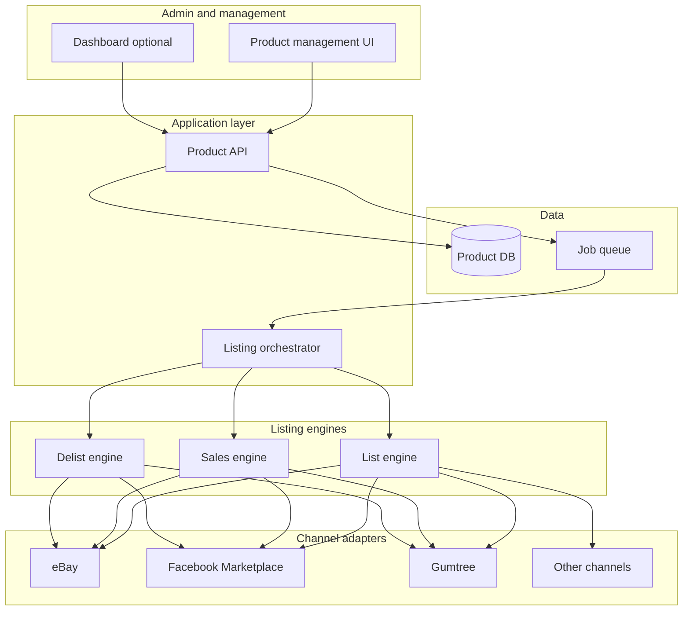

# RyuNova Platform – Design and Architecture

**RyuNova Platform** is an application businesses can use to manage **listing**, **channel integration**, **order review**, and **fulfillment** across multiple sales channels. The primary use case is **coffee machine and related products** (e.g. Coffee Machine Warehouse, usedcoffeegear.com), but the design is channel-agnostic and can be extended for other verticals and features.

## 1. Goals and scope

- **Product database:** Single source of truth for products (e.g. coffee machines): SKU, title, description, price, condition, images, category, attributes. Stored in **ryunova_product_master** with per-channel overrides and list flags (see Key modules below).
- **Listing management:** When a product has a list flag set for a channel, the system creates/updates listings on that channel. **Order review and fulfillment:** Orders imported from any channel are held in one place (**ryunova_order**, **ryunova_order_line**) with source channel info for integrated fulfillment.
- **Channels:** eBay, Facebook Marketplace, Gumtree, Shopify, usedcoffeegear, Amazon; **extensible**—new channels added by data and adapters, no schema change.
- **Engines:** List (create/update), Sales (sync orders/sold status), Delist (remove or mark sold).
- **Interfaces:** Product management (CRUD, bulk actions, list/delist flags), channel and config management, order review/fulfillment, optional dashboard for listing status and sales.

---

## 2. Key modules (discussed so far; option to extend)

| Module                                         | Purpose                                                                                                                                                                        |
| ---------------------------------------------- | ------------------------------------------------------------------------------------------------------------------------------------------------------------------------------ |
| **Product master & overrides**                 | ryunova_product_master, ryunova_product_channel_list_flag, ryunova_product_channel_override—single source of truth; per-channel list flags and overrides (title, price, etc.). |
| **User management & OAuth**                    | ryunova_users, ryunova_user_roles, ryunova_oauth_tokens—application login (e.g. SSO).                                                                                          |
| **App / system / user config & notifications** | ryunova_app_config, ryunova_user_settings, ryunova_notification_config—branding, version, key refs; per-user settings; how/when to send notifications.                         |
| **Channel registry & integration**             | ryunova_channels, ryunova_channel_config, ryunova_channel_credentials—pluggable adapters (eBay, Facebook, Gumtree, Shopify, usedcoffeegear, Amazon, etc.).                     |
| **Categories**                                 | ryunova_categories, ryunova_channel_category_mapping—internal tree; channel-specific category IDs.                                                                             |
| **Listing lifecycle**                          | ryunova_listing, ryunova_listing_history, ryunova_sale—list → listed_at; end → ended_at; sold → sold_at.                                                                       |
| **Inventory management**                       | ryunova_inventory_location, ryunova_inventory_level—quantity, reserved, low_stock_threshold; sync to channels; reserve on order.                                               |
| **Order import & fulfillment**                 | ryunova_order, ryunova_order_line—import from any channel; source_channel_info; single place for order review and fulfillment.                                                 |
| **Audit**                                      | ryunova_audit_log—changes to product_master, product_channel_override, listing (after first listing).                                                                          |
| **Listing jobs**                               | ryunova_listing_job—queue persistence for list/update/delist jobs.                                                                                                             |
| **Images**                                     | ryunova_product_image—S3 storage (bucket/key in DB).                                                                                                                           |

The application can be extended (e.g. more channels, reporting, 3PL integration, shipping labels) without changing this core; new features add data or application logic where possible.

---

## 3. High-level architecture

- **Product management UI** and optional **dashboard** talk to a **Product API**.
- **Product API** owns the product database and, when a product is saved with “list” set, enqueues **listing jobs** (or triggers the listing flow).
- A **listing orchestrator** (or separate consumers) runs three logical **engines**: **List** (create/update listings), **Sales** (sync sold/orders), **Delist** (remove or mark sold).
- Each engine uses **channel adapters** (eBay, Facebook Marketplace, Gumtree, etc.) so channel-specific APIs and rules live in one place.
- **Job queue** decouples “product updated” from “post to channels,” so listing is async and retriable.

---

## 4. Core components (high-level)

| Component                  | Responsibility                                                                                                                                                                                |
| -------------------------- | --------------------------------------------------------------------------------------------------------------------------------------------------------------------------------------------- |
| **Product DB (ryunova_*)** | ryunova_product_master, ryunova_product_channel_list_flag, ryunova_product_channel_override, ryunova_product_image; per-channel list flags and overrides (no per-channel columns on product). |
| **Product API**            | CRUD for products; on create/update, if list flag set, enqueue list job (and optionally sync jobs); order import and fulfillment updates.                                                     |
| **Order & inventory**      | ryunova_order, ryunova_order_line (order import, source_channel_info, fulfillment); ryunova_inventory_location, ryunova_inventory_level (quantity, reserved, low-stock).                      |
| **Listing orchestrator**   | Consumes jobs; decides create vs update; calls List engine; records per-channel listing IDs and status in ryunova_listing / ryunova_listing_history.                                          |
| **List engine**            | For each channel: map product to channel format, call adapter (eBay/FB/Gumtree/Shopify/usedcoffeegear/Amazon), store external listing ID and link to product.                                 |
| **Sales engine**           | Poll or webhook: get orders/sold items from adapters; update listing status; populate ryunova_order/ryunova_order_line for integrated order review and fulfillment.                           |
| **Delist engine**          | On request or when sold: call adapters to end listing or mark sold; update ryunova_listing status.                                                                                            |
| **Channel adapters**       | One per channel: translate product model to channel API payload; auth (OAuth/tokens), rate limits, errors; return listing ID and status; support order import.                                |

---

## 5. Data model (minimal, for discussion)

- **Product:** ryunova_product_master (id, sku, title, description, price, condition, category, attributes, etc.); per-channel list flags in ryunova_product_channel_list_flag; overrides in ryunova_product_channel_override; images in ryunova_product_image (S3 bucket/key).
- **Listing (per channel):** ryunova_listing—product_id, channel_id, external_listing_id, status (draft/listed/sold/ended/error), listed_at, ended_at, sold_at, last_synced_at, error_message.
- **Orders & fulfillment:** ryunova_order (channel_id, external_order_id, source_channel_info, status, fulfillment_status), ryunova_order_line (product_id, listing_id, quantity, fulfillment_status); single place for order review and fulfillment.
- **Inventory:** ryunova_inventory_location, ryunova_inventory_level (quantity, reserved, low_stock_threshold).
- **Other:** ryunova_sale (optional); ryunova_audit_log; ryunova_listing_job (queue); users, channels, config (see [DATABASE_SCHEMA.md](../DATABASE_SCHEMA.md)).

Full schema with all ryunova_* tables and enums is in this folder: **RyuNova/DATABASE_SCHEMA.md**.

---

## 6. Technology and platform options

Aligns with patterns already used in the repo (e.g. [Land_Feasibility_Compliance_Tool/ARCHITECTURE_AND_DESIGN_V1.md](Land_Feasibility_Compliance_Tool/ARCHITECTURE_AND_DESIGN_V1.md), [ROMS_Docs/ROMS DevOps Guide.md](ROMS_Docs/ROMS%20DevOps%20Guide.md)) but keeps choices flexible.

| Layer                | Option A (Python-centric) **Selected** | Option B (Java-centric)           | Notes                                                                                                                                          |
| -------------------- | ------------------------------------- | --------------------------------- | ---------------------------------------------------------------------------------------------------------------------------------------------- |
| **Product API**      | **Python 3.11+ / FastAPI**            | Java / Spring Boot                | FastAPI: quick to build, async; good for many small adapter calls. Spring Boot: aligns with existing roms-api.                                 |
| **Admin UI**         | **Django**                            | Django                            | Django for frontend (admin UI); templates and views consume FastAPI backend.                                                                  |
| **Database**         | **PostgreSQL**                        |                                   | Same as ROMS/Land; JSONB for flexible attributes; strong consistency for product and listing state.                                            |
| **Job queue**        | **Celery + Redis** or **RQ**          | Spring + Redis / SQS              | Decouples “flag set” from “post to eBay”; retries and scheduling (e.g. rate limits).                                                           |
| **Channel adapters** | **Python** (same process or workers)  | Java or Python (separate service) | eBay: REST/Open API; Facebook: Graph API; Gumtree: API if available or controlled automation. Adapters can be Python even if main API is Java. |
| **Hosting**          | **AWS (EC2 + RDS)** or **single VPS** | Same                              | Start single region; scale with queue workers and DB.                                                                                          |

**Recommendation for "easy management" and fast iteration:**  
**FastAPI (API) + Django (frontend / admin UI) + PostgreSQL + Celery/Redis (queue)** with **Python-based channel adapters**. Single language (Python) for backend and frontend; Django serves the admin UI and consumes the FastAPI API.

---

## 7. Flow: Auto list when flag is set (and order import)

1. User creates/edits product in **Admin UI**, sets list-to-channel flags (e.g. eBay, Facebook, Gumtree, Shopify, usedcoffeegear, Amazon) and saves.
2. **Product API** persists product and, if any list flag is on, enqueues a job: e.g. `ListingJob(product_id, channels=[...])`.
3. **Worker** (Celery/RQ) picks up job; **listing orchestrator** loads product, checks which channels are requested and which already have listings.
4. For each channel, **List engine** calls the **channel adapter** to create or update listing; adapter returns external ID and status.
5. **Orchestrator** writes **ryunova_listing** rows (product_id, channel_id, external_listing_id, status).
6. **Sales engine** (scheduled or webhook): reads from adapters for orders/sold items; updates listing status; can populate **ryunova_order** / **ryunova_order_line** for integrated order review and fulfillment; optionally triggers **Delist engine** for other channels.
7. **Delist engine** (manual or after sold): calls adapters to end listing; updates ryunova_listing status.

---

## 8. Channel integration (high-level)

- **eBay:** REST/Open API (listings, orders, inventory); OAuth2; rate limits and categories/catalog.
- **Facebook Marketplace:** Graph API (Commerce); permissions and listing format differ from eBay; may require Meta Business setup.
- **Gumtree:** Public API availability varies by region; may need partner/API access or documented automation within ToS.

Each adapter: **auth**, **map product → channel payload**, **create/update/end listing**, **map channel response → internal Listing model**. Adapters should be **pluggable** (interface + config per channel) so new channels (e.g. Shopify, Amazon) can be added without changing the core engines.

---

## 9. Security and operations (high-level)

- **Secrets:** Store channel API keys/tokens in a vault (e.g. AWS Secrets Manager or env) and inject into adapters; never in product DB.
- **Auth for Admin UI:** Same as other internal tools (e.g. OAuth2/SSO or simple login); Product API protected by same auth.
- **Rate limits:** Respect per-channel limits inside adapters; use queue + backoff/retry so listing is reliable.
- **Idempotency:** Use product_id + channel as idempotency key for create/update so duplicate jobs do not create duplicate listings.

---

## 10. Possible next steps (to add detail later)

- **Detailed data model:** Full schema in RyuNova/DATABASE_SCHEMA.md (ryunova_* tables/enums). Design history: RyuNova/DESIGN_DEVELOPMENT_HISTORY.md.
- **API spec:** OpenAPI for Product API and internal endpoints for orchestrator/engines.
- **UI wireframes:** Product list/detail, bulk “list to channels,” listing status per product.
- **Channel deep-dives:** eBay/FB/Gumtree/Shopify/usedcoffeegear/Amazon API docs, auth flows, and field mapping tables.
- **Deployment:** Docker Compose (or AWS ECS/EC2), PostgreSQL (RDS or self-hosted), Redis, one or more workers; CI/CD (e.g. GitHub Actions) similar to ROMS.

This gives a high-level framework for **RyuNova Platform**: listing, channel integration, order review and fulfillment, with a primary use case for coffee machine (and related) products. Clear separation between product management, listing/sales/delist engines, channel adapters, and order/inventory; design is extensible for more channels and features. Full schema: **RyuNova/DATABASE_SCHEMA.md** (all objects prefixed `ryunova_`). Design development history: **RyuNova/DESIGN_DEVELOPMENT_HISTORY.md**.