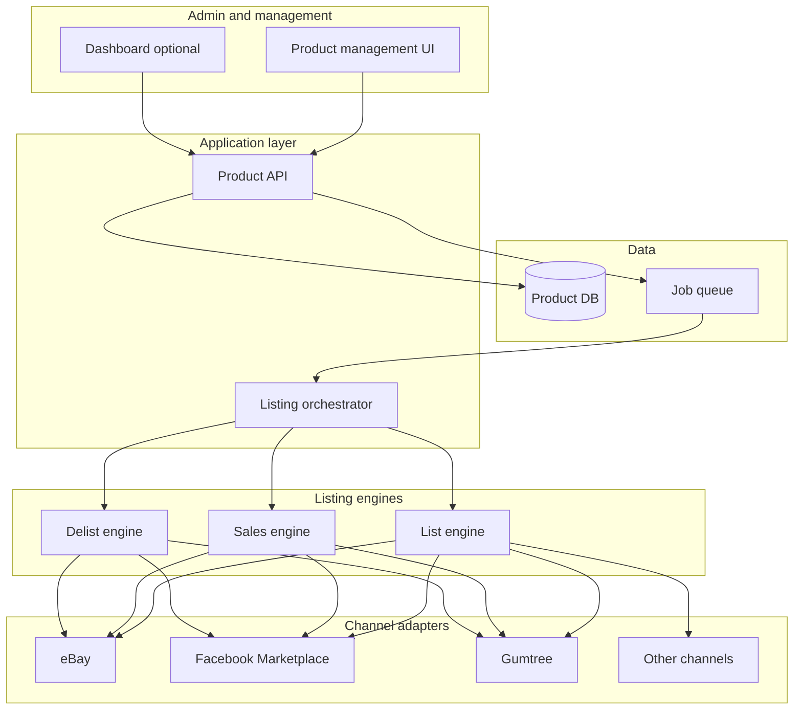

# Coffee Machine Product & Multi-Channel Listing Application – Design and Architecture

## 1. Goals and scope

- **Product database:** Single source of truth for coffee machines and related products (SKU, title, description, price, condition, images, category, attributes).
- **Auto-listing:** When a product has a “list” flag set (e.g. `list_to_channels = true` or per-channel flags), the system creates/updates listings on selected channels.
- **Channels (initial):** eBay, Facebook Marketplace, Gumtree; **extensible** for Shopify, Amazon, etc.
- **Engines:** Listing (create/update), Sales (sync orders/sold status), Delisting (remove or mark sold).
- **Interfaces:** Product management (CRUD, bulk actions, list/delist flags), optional dashboard for listing status and sales.

---

## 2. High-level architecture

- **Product management UI** and optional **dashboard** talk to a **Product API**.
- **Product API** owns the product database and, when a product is saved with “list” set, enqueues **listing jobs** (or triggers the listing flow).
- A **listing orchestrator** (or separate consumers) runs three logical **engines**: **List** (create/update listings), **Sales** (sync sold/orders), **Delist** (remove or mark sold).
- Each engine uses **channel adapters** (eBay, Facebook Marketplace, Gumtree, etc.) so channel-specific APIs and rules live in one place.
- **Job queue** decouples “product updated” from “post to channels,” so listing is async and retriable.

---

## 3. Core components (high-level)

| Component | Responsibility |
|-----------|----------------|
| **Product DB** | Products, variants, images, pricing, condition; flags like `list_to_ebay`, `list_to_facebook`, `list_to_gumtree`, or a single `list_to_channels` with a channel set. |
| **Product API** | CRUD for products; on create/update, if list flag set, enqueue “list” job (and optionally “sync” jobs). |
| **Listing orchestrator** | Consumes jobs; decides create vs update; calls List engine; records per-channel listing IDs and status. |
| **List engine** | For each channel: map product → channel format, call adapter (eBay/FB/Gumtree API), store external listing ID and link to product. |
| **Sales engine** | Poll or webhook: get orders/sold items from adapters; update product/listing status (e.g. sold); optionally trigger delist on other channels. |
| **Delist engine** | On request or when sold: call adapters to end listing or mark sold; update local status. |
| **Channel adapters** | One per channel: translate product model → channel API payload; handle auth (OAuth/tokens), rate limits, errors; return listing ID and status. |

---

## 4. Data model (minimal, for discussion)

- **Product:** id, sku, title, description, price, condition (new/used), category, attributes (JSON or normalised), image URLs, `list_to_ebay` (bool), `list_to_facebook` (bool), `list_to_gumtree` (bool), created/updated timestamps.
- **Listing (per channel):** product_id, channel (eBay/FB/Gumtree), external_listing_id, status (draft/listed/sold/ended/error), last_synced, error_message (for retries).
- **Sales/orders (optional for later):** channel, external_order_id, product_id, quantity, amount, status; link to Listing.

Exact schema (e.g. variants, multi-quantity, categories) can be detailed in a later phase.

---

## 5. Technology and platform options

Aligns with patterns already used in the repo (e.g. [Land_Feasibility_Compliance_Tool/ARCHITECTURE_AND_DESIGN_V1.md](Land_Feasibility_Compliance_Tool/ARCHITECTURE_AND_DESIGN_V1.md), [ROMS_Docs/ROMS DevOps Guide.md](ROMS_Docs/ROMS%20DevOps%20Guide.md)) but keeps choices flexible.

| Layer | Option A (Python-centric) **Selected** | Option B (Java-centric) | Notes |
|-------|----------------------------|---------------------------|--------|
| **Product API** | **Python 3.11+ / FastAPI** | Java / Spring Boot | FastAPI: quick to build, async; good for many small adapter calls. Spring Boot: aligns with existing roms-api. |
| **Admin UI** | **Django** | Django | Django for frontend (admin UI); templates and views consume FastAPI backend. |
| **Database** | **PostgreSQL** | PostgreSQL | Same as ROMS/Land; JSONB for flexible attributes; strong consistency for product and listing state. |
| **Job queue** | **Celery + Redis** or **RQ** | Spring + Redis / SQS | Decouples “flag set” from “post to eBay”; retries and scheduling (e.g. rate limits). |
| **Channel adapters** | **Python** (same process or workers) | Java or Python (separate service) | eBay: REST/Open API; Facebook: Graph API; Gumtree: API if available or controlled automation. Adapters can be Python even if main API is Java. |
| **Hosting** | **AWS (EC2 + RDS)** or **single VPS** | Same | Start single region; scale with queue workers and DB. |

**Recommendation for “easy management” and fast iteration:**  
**FastAPI (API) + Django (frontend / admin UI) + PostgreSQL + Celery/Redis (queue)** with **Python-based channel adapters**. Single language (Python) for backend and frontend; Django serves the admin UI and consumes the FastAPI API.

---

## 6. Flow: “Auto list when flag is set”

1. User creates/edits product in **Admin UI**, sets “List to eBay” (and/or Facebook, Gumtree) and saves.
2. **Product API** persists product and, if any list flag is on, enqueues a job: e.g. `ListingJob(product_id, channels=[ebay, facebook, gumtree])`.
3. **Worker** (Celery/RQ) picks up job; **listing orchestrator** loads product, checks which channels are requested and which already have listings.
4. For each channel, **List engine** calls the **channel adapter** (eBay/FB/Gumtree) to create or update listing; adapter returns external ID and status.
5. **Orchestrator** writes **Listing** rows (product_id, channel, external_listing_id, status).
6. **Sales engine** (scheduled or webhook): reads from adapters for orders/sold items; updates Listing status and optionally triggers **Delist engine** for other channels.
7. **Delist engine** (manual or after sold): calls adapters to end listing; updates Listing status.

---

## 7. Channel integration (high-level)

- **eBay:** REST/Open API (listings, orders, inventory); OAuth2; rate limits and categories/catalog.
- **Facebook Marketplace:** Graph API (Commerce); permissions and listing format differ from eBay; may require Meta Business setup.
- **Gumtree:** Public API availability varies by region; may need partner/API access or documented automation within ToS.

Each adapter: **auth**, **map product → channel payload**, **create/update/end listing**, **map channel response → internal Listing model**. Adapters should be **pluggable** (interface + config per channel) so new channels (e.g. Shopify, Amazon) can be added without changing the core engines.

---

## 8. Security and operations (high-level)

- **Secrets:** Store channel API keys/tokens in a vault (e.g. AWS Secrets Manager or env) and inject into adapters; never in product DB.
- **Auth for Admin UI:** Same as other internal tools (e.g. OAuth2/SSO or simple login); Product API protected by same auth.
- **Rate limits:** Respect per-channel limits inside adapters; use queue + backoff/retry so listing is reliable.
- **Idempotency:** Use product_id + channel as idempotency key for create/update so duplicate jobs do not create duplicate listings.

---

## 9. Possible next steps (to add detail later)

- **Detailed data model:** Normalised schema, variants, categories, images.
- **API spec:** OpenAPI for Product API and internal endpoints for orchestrator/engines.
- **UI wireframes:** Product list/detail, bulk “list to channels,” listing status per product.
- **Channel deep-dives:** eBay/FB/Gumtree API docs, auth flows, and field mapping tables.
- **Deployment:** Docker Compose (or AWS ECS/EC2), PostgreSQL (RDS or self-hosted), Redis, one or more workers; CI/CD (e.g. GitHub Actions) similar to ROMS.

This gives a high-level framework to manage a coffee machine product database and auto-list to eBay, Facebook Marketplace, Gumtree (and others) when a flag is set, with clear separation between product management, listing/sales/delist engines, and channel adapters. Details (exact schema, API contracts, UI flows) can be added in follow-up design docs.
