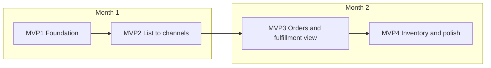

# Proposal content plan: Build RyuNova Platform for coffee machine client

## Purpose

Create **proposal content** to present to the coffee machine client (e.g. GLOBAL COFFEE EMPORIUM PTY LTD / Coffee Machine Warehouse) so they can approve building the **RyuNova Platform** application. The proposal must give **assurance that the application will make their staff’s life easier**, set out **key messages**, and describe an **agile, 2-month build** with a clear **MVP sequence**.

**Context (from [globalcoffee/PROPOSAL_CONVERSATION_HISTORY.md](globalcoffee/PROPOSAL_CONVERSATION_HISTORY.md)):** Client sells new and used coffee machines, has **limited staff**, struggles to keep **eBay and website** (e.g. Shopify) updated, does Google Ads with little social. Existing proposal in globalcoffee is for Digital Content and Social Media Marketing; this new proposal is specifically for **building the RyuNova Platform application** (listing, channel integration, order review, fulfillment).

---

## 1. Assurance: how the application makes staff life easier

The proposal will state these **assurance points** clearly (in executive summary and benefits section):

| Assurance                          | Explanation for client                                                                                                                                                                             |
| ---------------------------------- | -------------------------------------------------------------------------------------------------------------------------------------------------------------------------------------------------- |
| **One place for products**         | Enter or edit a product once; the system can push it to website (Shopify), eBay, and other channels. No more copying titles, prices, and descriptions between platforms.                           |
| **Controlled, visible listing**    | Staff choose which products go to which channel with simple “list here” flags. Listing status (draft, listed, ended, sold) is visible in one dashboard so the team always knows what’s live where. |
| **Orders in one place**            | Orders from eBay, Shopify, and other channels can be brought into one list for review and fulfillment, with source channel kept for traceability. Less switching between platforms.                |
| **Less manual work, fewer errors** | Fewer manual updates and copy-paste mistakes; consistent product and pricing data across channels.                                                                                                 |
| **Time back for the team**         | Focus on sales and customer service instead of repetitive listing and sync tasks. Aligns with “taking the burden off them” messaging already used for this client.                                 |
| **Built in small steps**           | Delivered in small, working increments (MVPs) over 2 months so the client sees progress early and can give feedback.                                                                               |

These will be written in plain language (no jargon like “ryunova_” or “listing orchestrator”) and tied to the client’s pain: limited staff, eBay + website updates, and desire for a single place to manage listings and orders.

---

## 2. Key points of communication

The proposal will structure **key messages** so the client hears a consistent story. Suggested sections and bullets:

- **What we’re proposing**  
Build a dedicated application (RyuNova Platform) that manages your product catalogue, pushes listings to your sales channels (e.g. Shopify, eBay, and optionally others), and brings orders into one place for review and fulfillment.
- **Why it helps your team**  
One product entry, multiple channels; clear listing status; one order list; less manual work and fewer errors; time back for staff (as above).
- **How we’ll work**  
Agile delivery: short iterations (e.g. 2-week sprints), working software at the end of each MVP, demos and feedback, and scope prioritised with you so the most valuable features come first.
- **What you’ll see and when**  
A 2-month timeline with 3–4 MVPs (see below). After each MVP you get something usable (e.g. product management, then listing to one channel, then multi-channel, then orders). No “big bang” at the end.
- **What we need from you**  
Access to channels (e.g. Shopify admin, eBay seller account/API), product/category decisions, and availability for short demos and prioritisation (e.g. every 2 weeks).
- **What’s in and out for this engagement**  
In scope: product master, listing to selected channels, order import and order review/fulfillment view, basic inventory view. Out of scope (or later phase): 3PL integration, advanced reporting, shipping labels—unless explicitly added.
- **Next step**  
Confirm scope and MVP order; then we schedule kick-off and first sprint.

---

## 3. Agile method: how we’ll build it progressively

The proposal will describe a simple **agile approach** (no need to name Scrum/Kanban unless the client prefers):

- **Iterations (sprints):** Development in time-boxed iterations (e.g. 2 weeks). Each iteration produces a potentially shippable increment.
- **Prioritisation:** Backlog ordered by business value and dependency. Client (or nominated lead) joins a short prioritisation/review so the next MVP and stories are agreed.
- **Demos and feedback:** At the end of each MVP (or every 2 weeks), a demo of working software. Feedback feeds the next iteration.
- **Change and scope:** New ideas are welcomed; we add them to the backlog and re-prioritise. If something must be in “2 months,” we protect it; other items can move to a later phase.
- **Transparency:** Progress visible via working software and a simple view of “done” vs “next” (e.g. in the proposal as a timeline; later optionally a board or list).

This section will be short (one page or less) so the client sees we have a clear, repeatable way of working that reduces risk and gives them control.

---

## 4. Two-month timeline and MVP sequence

The application will be built over **2 months** as a sequence of **Minimum Viable Products (MVPs)**. Each MVP is a usable slice that the client can see and use.

**Suggested MVP sequence (to be confirmed with client):**

| MVP      | Name                        | Duration  | What staff get                                                                                                                                                | Build steps (high level)                                                                                                                                  |
| -------- | --------------------------- | --------- | ------------------------------------------------------------------------------------------------------------------------------------------------------------- | --------------------------------------------------------------------------------------------------------------------------------------------------------- |
| **MVP1** | Foundation and product hub  | Weeks 1–2 | Single place to add/edit products (SKU, title, description, price, condition, images). Product list and basic search. No channel sync yet.                    | Set up project, DB (product_master, product_image, categories), auth, simple Product CRUD API and admin UI; deploy to a test environment.                 |
| **MVP2** | List to channels            | Weeks 3–4 | Choose which products list to which channel (e.g. Shopify, eBay). Trigger “list” and see status (draft/listed/ended). First channel(s) go live.               | Channel registry and credentials; listing engine and one or two channel adapters (e.g. Shopify, eBay); list/delist from UI; listing and listing_history.  |
| **MVP3** | Orders and fulfillment view | Weeks 5–6 | Orders from connected channels appear in one list. View order details, source channel, and line items. Update fulfillment status (e.g. shipped) in one place. | Order import from channel APIs; order and order_line; order list and detail UI; basic fulfillment status update; optional sync-back of status to channel. |
| **MVP4** | Inventory and polish        | Weeks 7–8 | Simple inventory view (quantity, reserved). Alerts or visibility when stock is low. Bug fixes, performance, and any agreed “must-haves” before handover.      | inventory_location and inventory_level; reserve on order (optional); low-stock visibility; notifications (optional); hardening, docs, handover.           |

- **Month 1** = MVP1 + MVP2 (foundation and listing to channels).  
- **Month 2** = MVP3 + MVP4 (orders/fulfillment view and inventory/polish).

Dependencies: MVP2 depends on MVP1; MVP3 can start once at least one channel is listing (MVP2); MVP4 builds on MVP3 for inventory/order linkage. If the client wants “orders” earlier, MVP2 and MVP3 can be reordered or partially overlapped (e.g. minimal listing in week 3, then orders in weeks 4–5), but the proposal will present the above as the default 2-month sequence.

---

## 5. Steps required to build it progressively (summary)

1. **Kick-off and alignment** – Confirm scope, MVP order, and channel priorities (e.g. Shopify first, then eBay). Agree demo and feedback cadence (e.g. every 2 weeks).
2. **MVP1 (Weeks 1–2)** – Foundation: product master, images, categories, auth, Product CRUD UI. Demo: “You can manage your products in one place.”
3. **MVP2 (Weeks 3–4)** – Listing: channel config, list/delist, status. Demo: “You can list selected products to [channel(s)] and see status here.”
4. **MVP3 (Weeks 5–6)** – Orders: import and single list, fulfillment status. Demo: “You can see and manage orders from all channels in one place.”
5. **MVP4 (Weeks 7–8)** – Inventory visibility and polish; fixes and handover. Demo: “You have inventory visibility and a stable app ready for daily use.”
6. **Handover** – Documentation, access, and optional support period as agreed.

---

## 6. Deliverable: where the proposal content will live

- **Output:** A single **proposal document** (e.g. `RyuNova/PROPOSAL_BUILD_RYUNOVA_CHANNELS.md` or `globalcoffee/Proposal_Build_RyuNova_Channels.md`) containing:
  - Title and client name (e.g. Coffee Machine Warehouse / GLOBAL COFFEE EMPORIUM PTY LTD).
  - Executive summary (assurance + 2-month agile MVPs).
  - How the application makes staff life easier (Section 1 above).
  - Key points of communication (Section 2).
  - Agile method (Section 3).
  - Two-month timeline and MVP sequence (Section 4), with table and optional diagram.
  - Steps to build progressively (Section 5).
  - Scope in/out, assumptions, what we need from you, next steps.
  - Optional: high-level cost or effort (e.g. 2 months, X sprints) if the client expects it; otherwise leave for a separate commercial document.
- **Placement:** Either under **RyuNova/** (with other RyuNova design docs) or under **globalcoffee/** alongside the existing marketing proposal. Recommendation: **RyuNova/** so all “build this application” content is in one place; the proposal can still say “Prepared for Coffee Machine Warehouse” and reference the client.

---

## 7. What this plan does not include

- Actual pricing or contract terms (handled in a separate commercial/legal document).
- Technical implementation details (those stay in [RyuNova/DATABASE_SCHEMA.md](RyuNova/DATABASE_SCHEMA.md) and architecture plans).
- Changes to the existing Digital Content and Social Media Marketing proposal (globalcoffee); this is an additional proposal for building the application.

---

## Summary

| Item                  | Content                                                                                                                                     |
| --------------------- | ------------------------------------------------------------------------------------------------------------------------------------------- |
| **Assurance**         | One product place, list to many channels, orders in one list, less manual work, fewer errors, time back for staff, delivery in small steps. |
| **Key communication** | What we’re proposing; why it helps; how we’ll work (agile); what they’ll see and when; what we need; in/out of scope; next step.            |
| **Agile**             | 2-week iterations, prioritisation with client, demos and feedback, transparent progress, scope managed via backlog.                         |
| **2-month MVPs**      | MVP1 Foundation (W1–2), MVP2 List to channels (W3–4), MVP3 Orders and fulfillment view (W5–6), MVP4 Inventory and polish (W7–8).            |
| **Deliverable**       | One proposal document in RyuNova/ (or globalcoffee/) with the above sections, ready for client review.                                      |

Once this plan is approved, the next step is to **write the actual proposal document** (markdown and optionally a print-ready HTML version) using this structure and content.